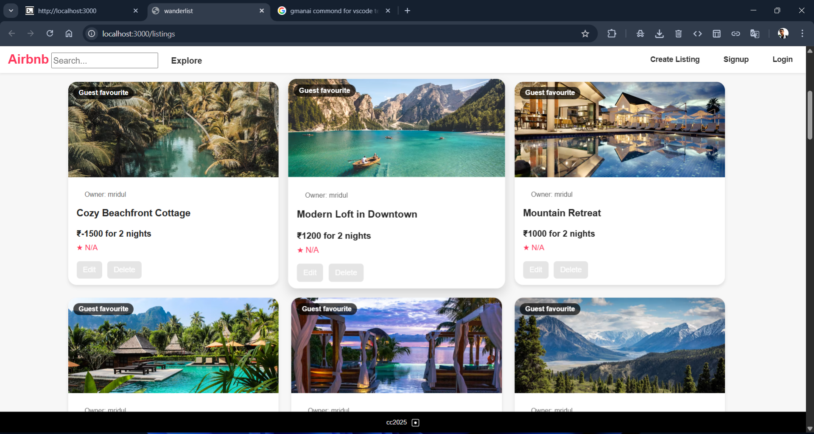

# 🏡 Airbnb Clone

Welcome to my **Airbnb Clone** — a full-stack web application that mimics the core features of Airbnb. Users can browse listings, view detailed information, book accommodations, and manage their profiles. 🚀

---

## 📸 Screenshots

### Homepage



---

## 🔥 Features

- 📝 **User Authentication:** Sign up, log in, and manage your profile securely.
- 🔍 **Search & Filters:** Find listings based on location, dates, price, and more.
- 🏘️ **Browse Listings:** Explore available properties with beautiful images and descriptions.
- 📝 **View Details:** Detailed pages for each listing, including amenities and reviews.
- 📅 **Booking System:** Book your stay and view your reservations.
- ⭐ **Reviews & Ratings:** Leave reviews and see others' feedback.
- 📱 **Responsive Design:** Looks great on both desktop and mobile devices.
- 🛠️ **Admin Panel (Optional):** Manage listings, bookings, and users (if implemented).

---

## 🛠️ Technologies Used

This project is built with a modern tech stack:

- **Frontend:** React.js, HTML5, CSS3, JavaScript ES6+
- **Backend:** Node.js, Express.js
- **Database:** MongoDB
- **Authentication:** JSON Web Tokens (JWT) / OAuth (if applicable)
- **Other Tools:** Axios, Material-UI / Bootstrap, Cloudinary (for images), etc.

---

## 🚀 Demo

🌐 **Live Deployment:** [Live URL](https://your-deployment-link.com)  
*(If you haven't deployed it yet, you can skip this or add your deployment link later.)*

---

## 🏁 Getting Started

Follow these steps to run the project locally on your machine:

### Prerequisites

- Node.js (version X.X.X or higher) installed
- MongoDB installed and running locally or remotely
- A code editor like VS Code

### Installation

1. **Clone the repository:**

```bash
git clone https://github.com/mridulchourasia1/FullStack-Projects.git
```

2. **Navigate into the project directory:**

```bash
cd Airbnb
```

3. **Install dependencies for both frontend and backend:**

```bash
npm install
```

*If your project has separate client and server folders, navigate into each and install dependencies separately.*

4. **Set up environment variables:**

Create a `.env` file in the root directory and add necessary variables like:

```env
PORT=5000
MONGO_URI=your_mongodb_connection_string
JWT_SECRET=your_jwt_secret
```

*(Adjust based on your setup.)*

5. **Start the development servers:**

```bash
npm run dev
```

*Or run frontend and backend separately:*

```bash
# For backend
npm run server

# For frontend
npm run client
```

6. **Open your browser** and go to `http://localhost:3000` (or the port you specified).

---

## 🌟 Contributing

Contributions are **welcome**! 🙌  
Feel free to open an issue for bugs or feature requests, or submit a pull request. 😊

**Steps to contribute:**

1. Fork the repo
2. Create your feature branch: `git checkout -b feature/your-feature`
3. Commit your changes: `git commit -m "Add your feature"`
4. Push to the branch: `git push origin feature/your-feature`
5. Open a pull request

---

## 📝 License

This project is licensed under the MIT License. See the [LICENSE](LICENSE) file for details. 📝

---

## 🎉 Acknowledgements

Thanks to all open-source libraries and tutorials that helped make this project possible! 🙏

---

## 📧 Contact

**Mridul Chourasia**  
Email: gitmridul18@gmail.com  
GitHub: [mridulchourasia1](https://github.com/mridulchourasia1)

---

*Enjoy exploring and customizing your own Airbnb clone! 🚀🏡*


