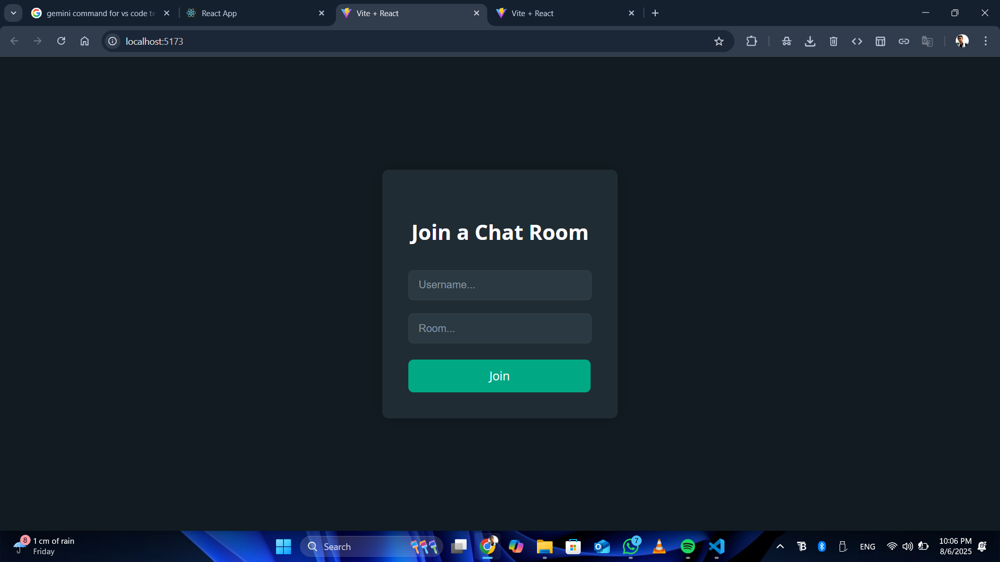

# Real-Time Chat Application

Welcome to the Real-Time Chat Application! 🚀  
This full-stack project demonstrates a functional, real-time messaging platform where multiple users can connect, send messages instantly, and see messages from others without refreshing the page.

---

## ✨ Features
- **Real-Time Messaging:** Instant message delivery with WebSockets (Socket.IO). 📡  
- **User Authentication:** Secure sign-up and login system. 🔐 
- **Responsive Design:** User-friendly interface that works on desktops and mobile devices. 📱  
- **Persistent Data:** Messages are stored in a MongoDB database. 💾

---

## 🛠️ Technologies Used
- **Frontend:** React.js, HTML, CSS, JavaScript  
- **Backend:** Node.js, Express.js  
- **Database:** MongoDB  
- **Real-time Communication:** Socket.IO

---

## 🚀 Getting Started

### Prerequisites
Make sure you have:
- Node.js installed  
- npm installed

Verify installations:
```bash
node -v
npm -v
```

### Installation
1. Clone the repository:
```bash
git clone https://github.com/mridulchourasia1/FullStack-Projects.git
```

2. Navigate into the project folder:
```bash
cd 2. Real Time Chat Application
```

3. Install dependencies:
```bash
npm install
```

4. Set up the client:
```bash
cd client
npm install
```

### Running the Application
1. Create a `.env` file in the root directory with your environment variables (e.g., database URL, secret keys).
2. Start the backend:
```bash
npm start
```
3. Open a new terminal, navigate to `client`, and start the frontend:
```bash
cd client
npm start
```

Visit `http://localhost:3000` in your browser to see the app in action! 🎉

---

## 📸 Screenshots


  


---

## 🤝 Contributing

Contributions are welcome! Feel free to fork, branch, and submit a pull request.

---

## 📝 License

Distributed under the MIT License. See `LICENSE` for more details.

---

## 🙏 Acknowledgments
- Node.js  
- React.js  
- MongoDB  
- Socket.IO
